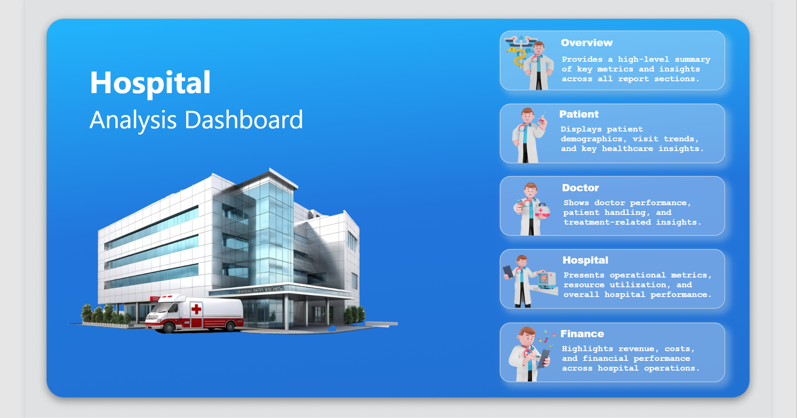
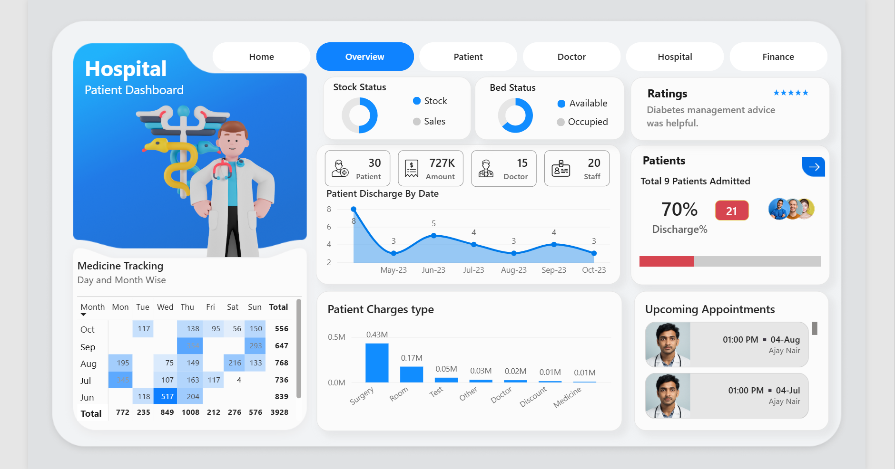
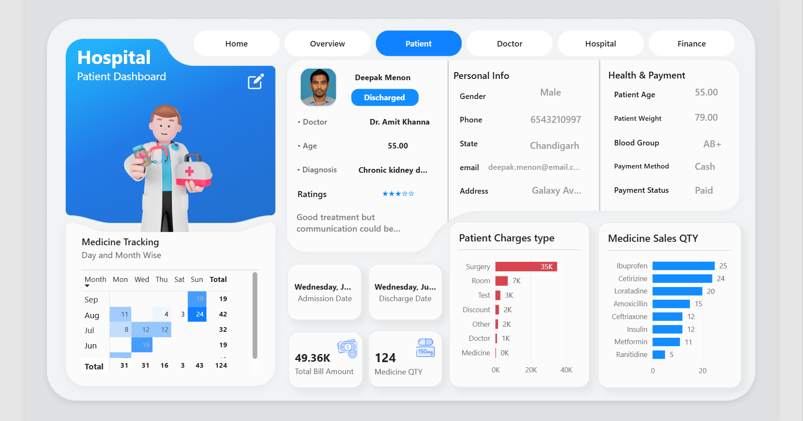
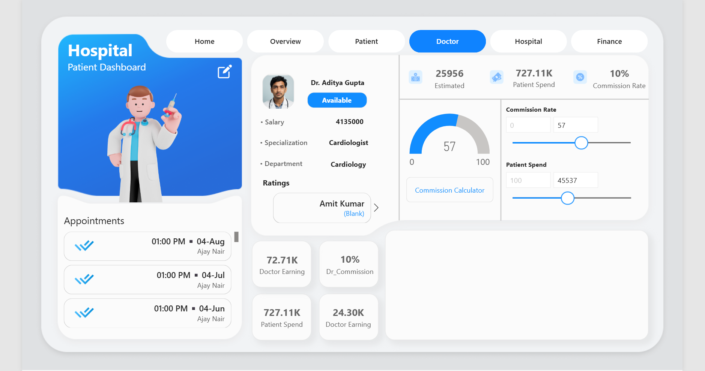
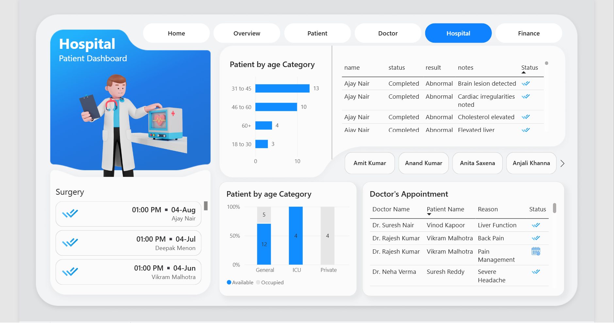
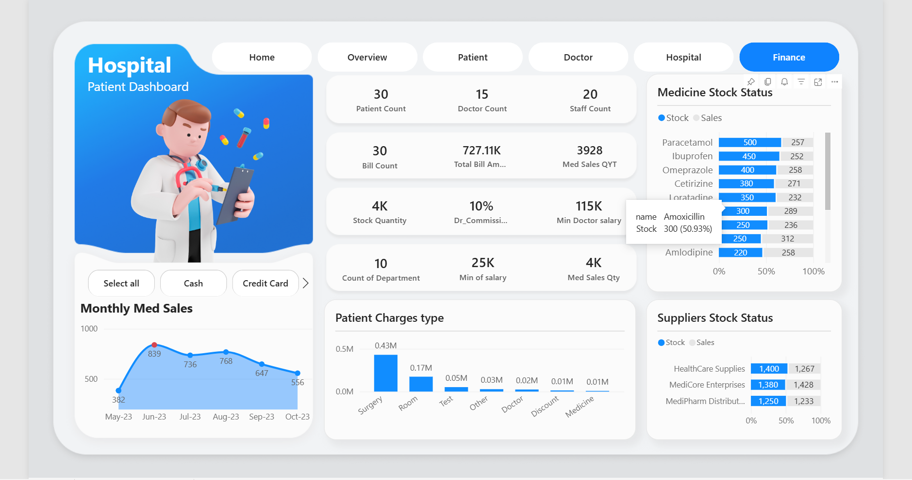
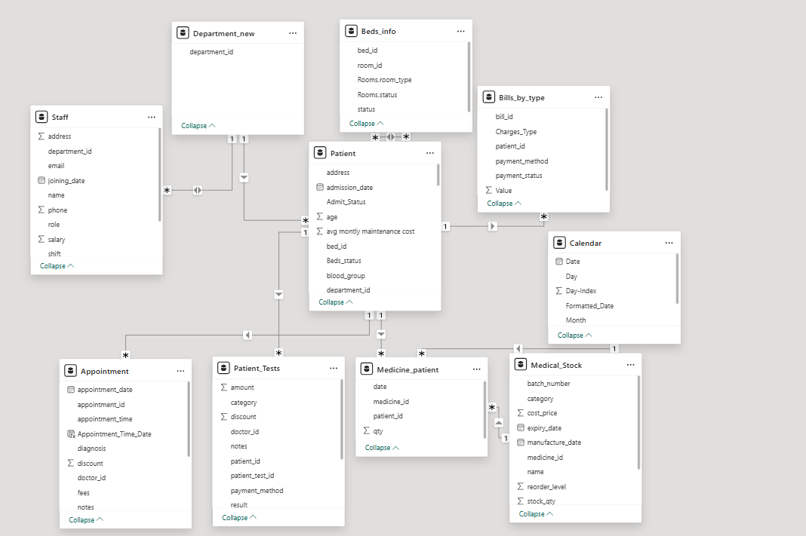

<div align="center">

# 🏥 Hospital Analytics Dashboard

### Power BI | Excel | Power Query | DAX


*A Business Intelligence dashboard that transforms raw hospital data into actionable insights for patient care, operations, and financial performance.*

</div>

---

# 📌 Project Overview

Hospitals generate data across multiple departments including patients, doctors, billing, appointments, medicine inventory, staff, and suppliers. Analyzing these datasets manually is time-consuming and often leads to delayed decision-making.

This project consolidates multiple **Excel (.xlsx)** datasets into a centralized **Power BI dashboard**, enabling hospital management to monitor KPIs, optimize operations, and make data-driven decisions.

---

# 🎯 Objectives

- Analyze hospital operations
- Monitor patient and doctor performance
- Track revenue and billing
- Monitor medicine inventory
- Visualize appointments and bed occupancy
- Build an interactive executive dashboard

---

# 📊 Dashboard Preview

## Home


## Overview


## Patient


## Doctor


## Hospital


## Finance


---

# 📂 Dataset

The dashboard is built using **15+ Microsoft Excel (.xlsx)** files representing different hospital entities.

### Dataset Includes

- 👨‍⚕️ Patient
- 🩺 Doctor
- 📅 Appointment
- 🏥 Department
- 💰 Hospital Bills
- 💊 Medical Stock
- 🧪 Medical Tests
- 🛏 Beds
- 🚪 Rooms
- 👨‍💼 Staff
- 🚚 Supplier
- ⭐ Satisfaction Score
- 🔪 Surgery


# 🧹 Data Preparation

Before building the dashboard, the data was transformed using **Power Query**.

✔ Removed unnecessary columns

✔ Cleaned missing values

✔ Renamed columns

✔ Standardized data types

✔ Built relationships between tables

✔ Optimized the data model

### Data Model



---

# 🐍 Python Automation

To improve the data preparation workflow, I developed a **Python application** that automatically converts multiple **Excel (.xlsx)** files into **CSV** format.

### Features

- Batch XLSX → CSV Conversion
- Folder Processing
- Automatic Output Generation
- Preserves File Names
- Faster Data Preparation

This tool can be reused in future analytics projects where CSV is required.

---

# 📈 Key KPIs

- Total Patients
- Total Doctors
- Total Staff
- Revenue
- Patient Charges
- Medicine Sales
- Bed Occupancy
- Patient Satisfaction
- Upcoming Appointments
- Medicine Inventory

---

# 💡 Business Questions Answered

- Which services generate the highest revenue?
- How many patients are admitted each month?
- What is the current bed occupancy?
- Which doctors handle the most patients?
- Which medicines require restocking?
- What are the most common payment methods?
- How satisfied are patients?

---

# 🛠 Tech Stack

| Tool | Purpose |
|------|---------|
| 📊 Power BI | Dashboard Development |
| 📄 Excel (.xlsx) | Data Source |
| ⚡ Power Query | Data Cleaning & ETL |
| 📐 DAX | KPIs & Measures |
| 🐍 Python | XLSX → CSV Automation |

---

# 📁 Repository Structure

```
Hospital-Analytics-Dashboard
│
├── Dashboard
│   └── Hospital Dashboard.pbix
│
├── Dataset
│   └── *.xlsx
│
├── Images
│   ├── Home.png
│   ├── Overview.png
│   ├── Patient.png
│   ├── Doctor.png
│   ├── Hospital.png
│   ├── Finance.png
│   └── DataModel.png
│
├── xlsx to csv converter
│
│
└── README.md
```

---

# 🚀 Skills Demonstrated

- Power BI Dashboard Development
- Data Cleaning & ETL
- Data Modeling
- DAX Measures
- Interactive Reporting
- Business Intelligence
- Data Visualization
- Python Automation

---

## ⭐ If you like this project, consider giving it a Star!
